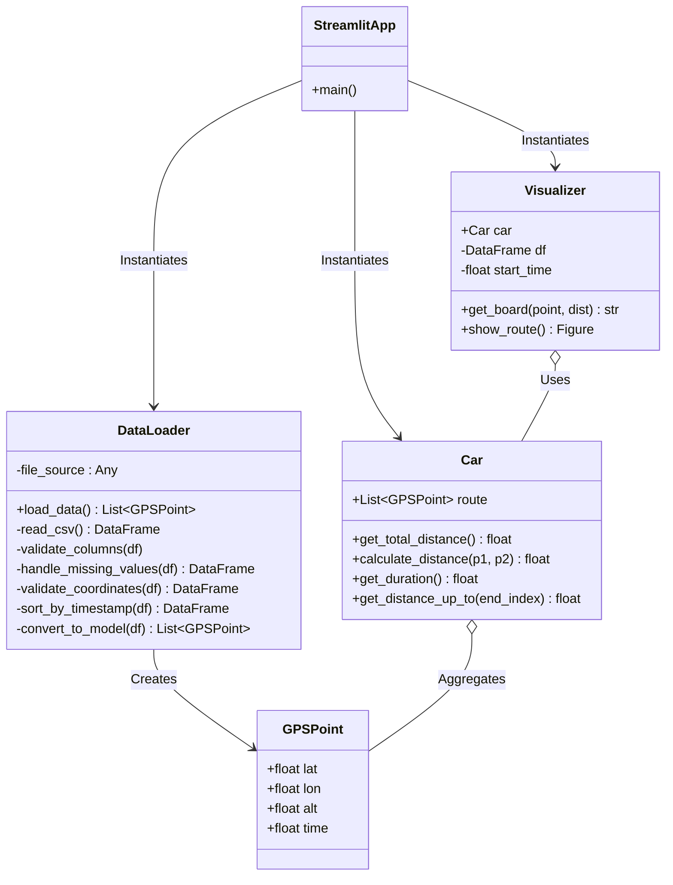

# SPEC.md: GPS Track Visualizer

## Overview
This document outlines the architecture, components, and data flow of the GPS Track Visualizer application. 
The application is designed to parse raw GPS tracking data from a CSV file, 
sanitize and format it into structured objects, calculate track metrics, 
and visually animate the car's progression along the track using a modern web interface.

## Architecture Diagram

		
## Component Responsibilities

1. **`GPSPoint`**
   - **Responsibility**: A typed dataclass representing a single GPS coordinate at a specific point in time. 
						It encapsulates the core properties (`lat`, `lon`, `alt`, `time`) to guarantee type safety across the system.

2. **`DataLoader`**
   - **Responsibility**: Handles reading the CSV file (from a file path or an uploaded file object), 
						validating the presence of required columns, cleaning the data, and transforming it into a list of `GPSPoint` objects.
   - **Edge Cases Handled**:
     - **Missing Columns**: Throws a descriptive `KeyError` if `lat`, `lon`, or `time` are missing.
     - **Malformed Altitudes**: Fills missing altitude values with `0.0`.
     - **Invalid Coordinates**: Filters out latitudes not between -90 and +90, and longitudes not between -180 and +180.
     - **Unsorted Data**: Casts timestamps to floats and strictly sorts the dataframe by the `time` column to ensure correct chronological playback.
     - **Empty File / Parsing Errors**: Throws a `ValueError` for empty or corrupted CSV data.

3. **`Car`**
   - **Responsibility**: Represents the physical vehicle traversing the route. Calculates accumulated metrics such as the total
						distance driven using the Haversine formula, and the total duration based on the first and last timestamps.

4. **`Visualizer`**
   - **Responsibility**: Encapsulates all plotting logic. It creates the interactive Plotly map (`go.Figure`) 
						containing a stationary trace line of the full route and an animated marker representing the car.
						It is responsible for generating the frames for the time-based animation and rendering a dynamic "Live Dashboard"
						annotation that updates distance, time, and coordinates in real-time as the car progresses.

5. **`StreamlitApp`**
   - **Responsibility**: Acts as the entry point. Handles user interactions, file uploading, error display, 
						and orchestrates the flow of data from the `DataLoader` to the `Car` and finally to the `Visualizer`.

## Data Flow

1. The user uploads a CSV file via the Streamlit interface in `main.py`.
2. The file object is passed to `DataLoader`.
3. `DataLoader` reads the file into a Pandas DataFrame.
4. `DataLoader` sanitizes the DataFrame (drops invalid bounds, fills NaNs, sorts by time).
5. `DataLoader` iterates over the DataFrame and instantiates `GPSPoint` objects, returning a `List[GPSPoint]`.
6. `main.py` passes the `List[GPSPoint]` to `Car` to compute total metrics (distance, duration).
7. `main.py` passes the `Car` instance to `Visualizer`.
8. `Visualizer` builds a `plotly.graph_objects.Figure` with animation frames.
9. `main.py` renders the resulting Figure to the web browser.
